# H&M KPI Dashboard

A real-time analytics dashboard built using microservices architecture on Google Cloud Platform, allowing users to view and analyze customer, article and transaction data. Developed as a Capstone project for the MCSBT at IE School of Science and Technology.

## Project links:

📊 [H&M Dashboard](https://streamlit-app-dot-fit-territory-377423.oa.r.appspot.com/) <br>
🔗 [SWAGGER](https://fit-territory-377423.oa.r.appspot.com/api/swagger)

## Screenshots

Below are some screenshots of the streamlit app:

### Login Page

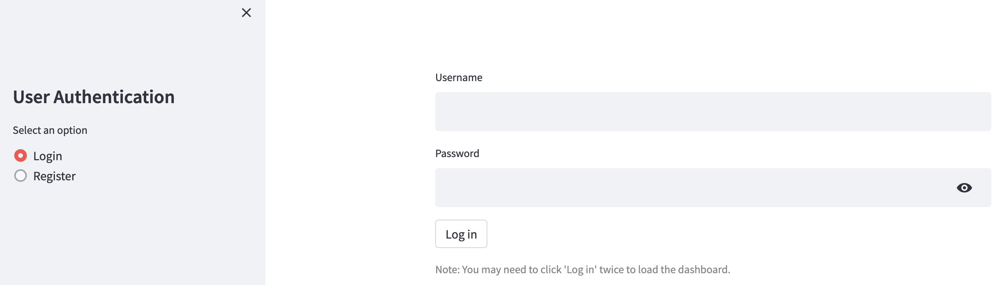

### Registration Page

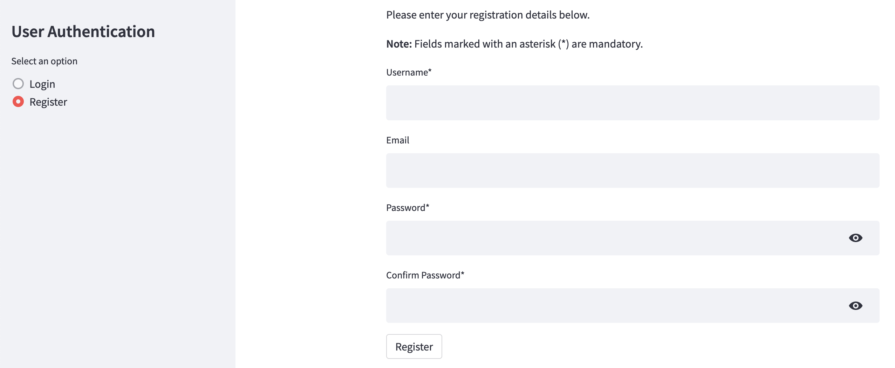

### Homepage

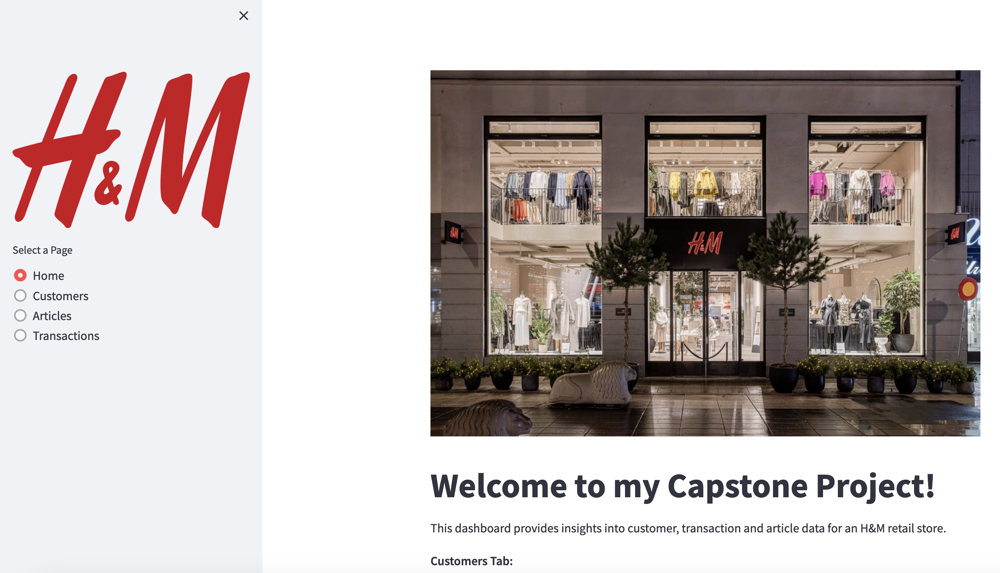

### Customer Data

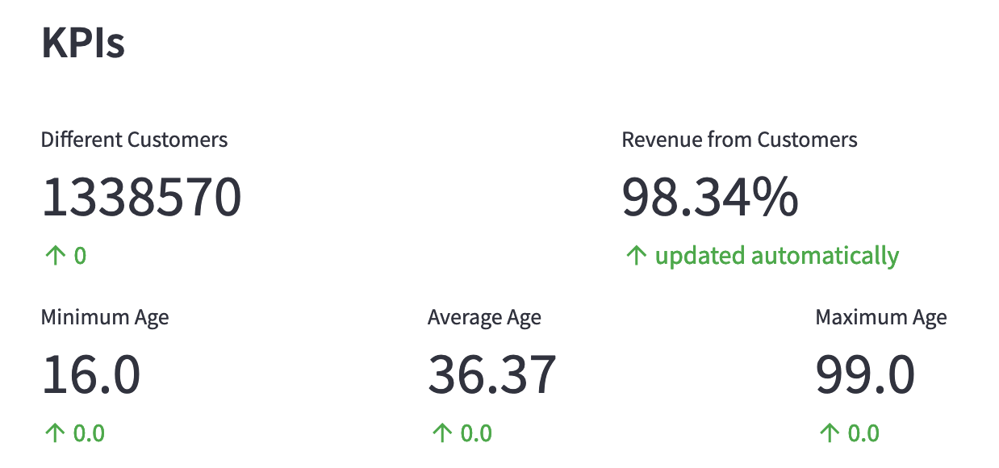
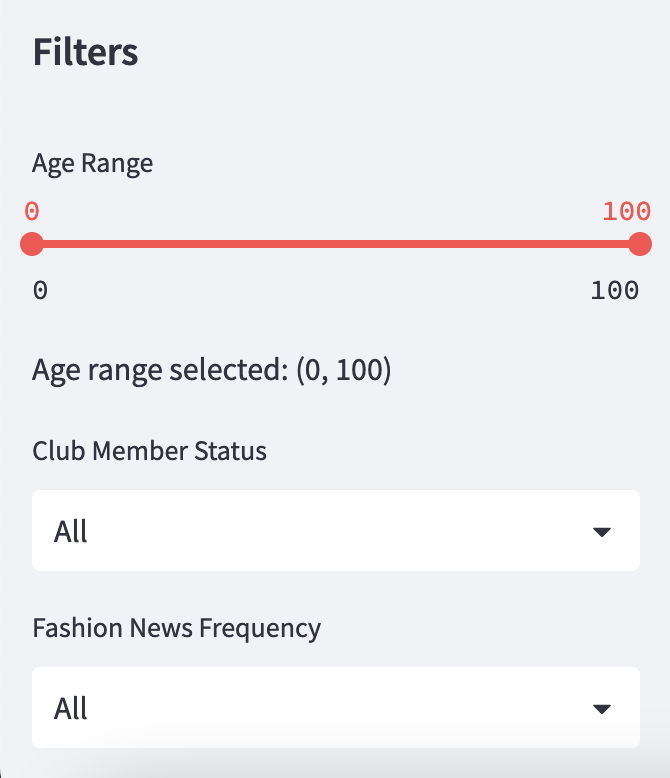
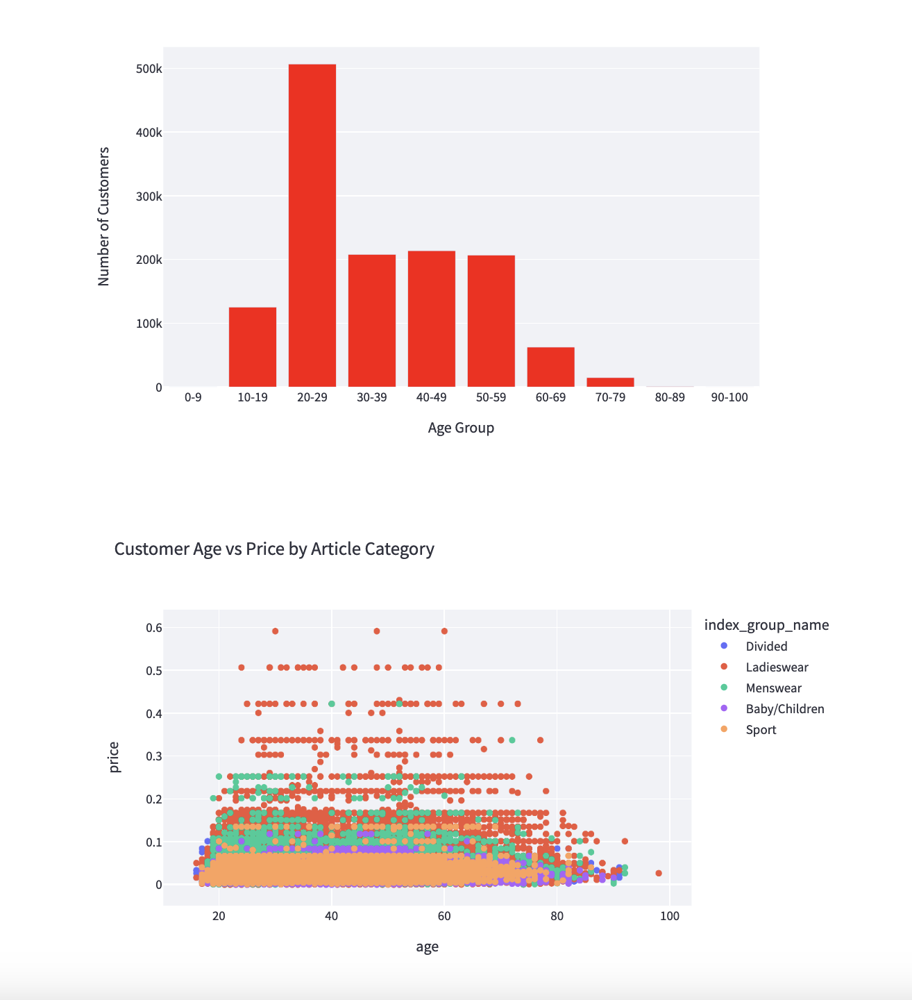

### Article Data

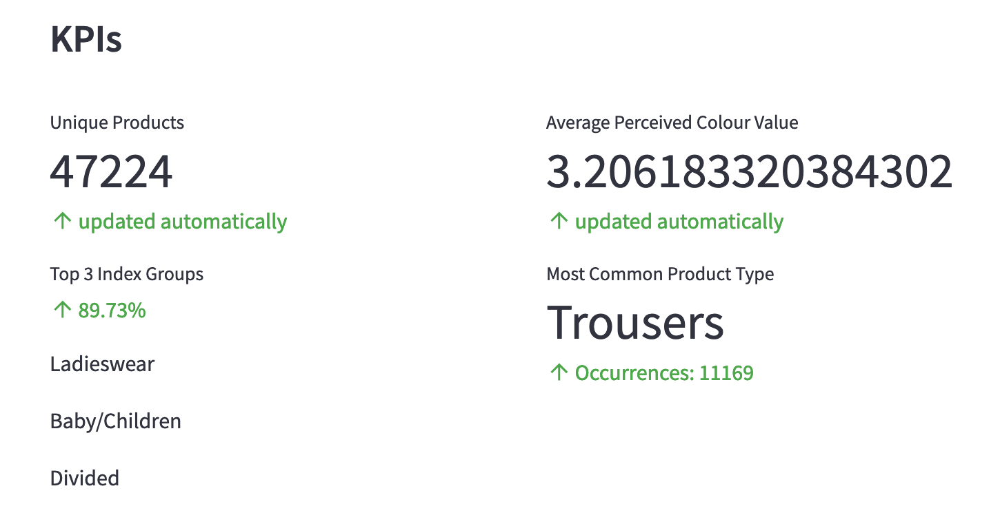
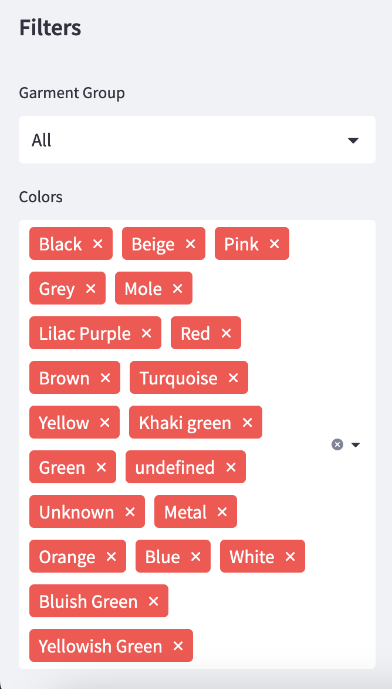
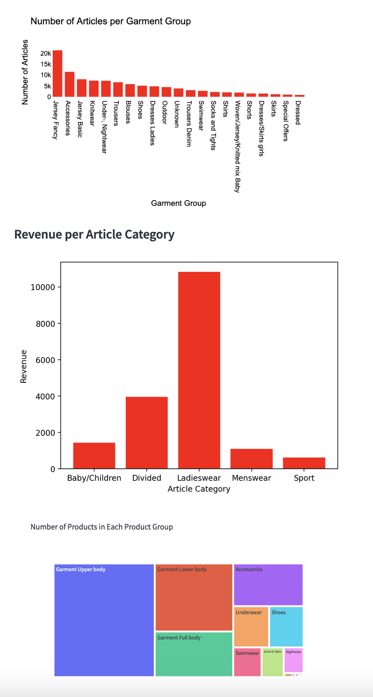

### Transaction Data

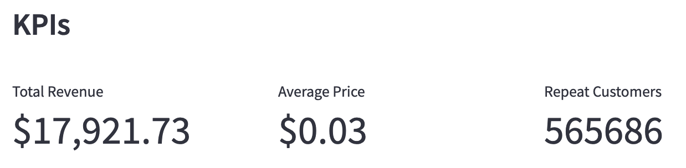
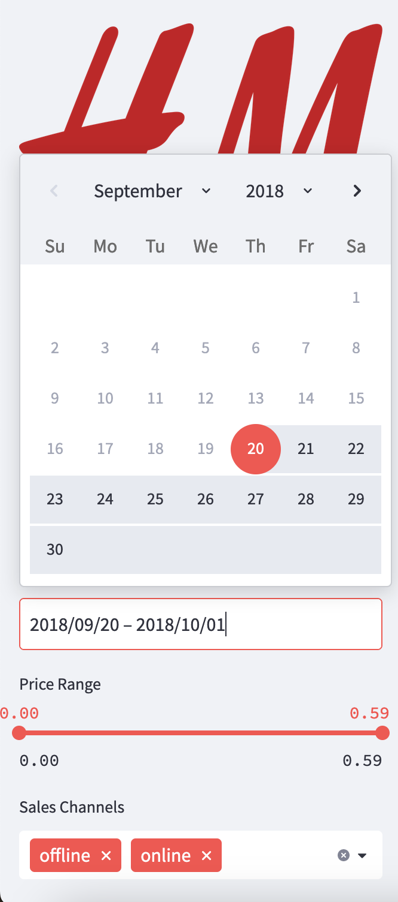
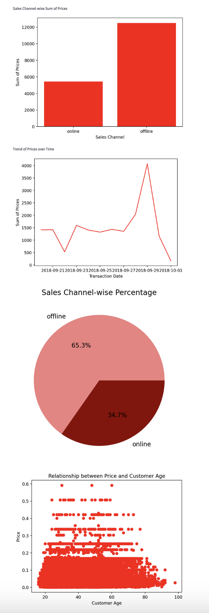

## Overview

The H&M KPI Dashboard is a web application that provides a comprehensive view of various KPIs using datasets from H&M. The application fetches, filters and displays KPI data in real-time using a cloud-based architecture.

This project consists of four main components:

1. A MySQL database hosted on Google Cloud SQL, containing four tables: customers, articles, transactions and user_credentials.
2. A frontend built with Streamlit, allowing users to log in, register and view data visualizations based on customer, article and transaction data.
3. A backend API built with Flask, responsible for handling user authentication and serving data to the frontend from the database in JSON format via HTTP GET requests.
4. User authentication and registration, which stores user information in the user_credentials table in the database and checks credentials during login.

The frontend and backend are both deployed on Google App Engine, enabling a seamless connection between the two components and allowing users to access the dashboard from anywhere with an internet connection. To improve loading times, the application limits the number of rows fetched for articles and transactions tables to 1000 rows each.

## How to Run the Project Locally

1. Clone the repository:

```
git clone https://github.com/sophieschaesberg/HnM-dashboard.git
```

2. Set up a virtual environment and activate it:

```
python3 -m venv venv
source venv/bin/activate
```

3. Install the required packages for both frontend and backend:

```
cd frontend
pip install -r requirements.txt
cd ../backend
pip install -r requirements.txt
```

4. Run the Flask API:

```
cd backend
python api.py
```

5. In another terminal, run the Streamlit front-end:

```
cd frontend
streamlit run streamlit.py
```

## Security

API keys are used to secure the connection between the frontend and the backend. The frontend sends the API key in the Authorization header when making requests to the backend. The backend then verifies the API key before processing the request.

## Database Structure

The MySQL database contains four tables:

1. customers: Contains customer-related data, such as customer_id, club_member_status, fashion_news_frequency and age.
2. articles: Contains article-related data, such as article_id, article name and category. The number of rows is limited to 1000 for faster loading times.
3. transactions: Contains transaction-related data, such as transaction_id, customer_id, article_id and date. The number of rows is limited to 1000 for faster loading times.
4. user_credentials: Stores user information (username, e-mail and password) for authentication during login and registration.

## Built With

- [Streamlit](https://streamlit.io/) - The frontend framework used
- [Flask](https://flask.palletsprojects.com/) - The backend framework used
- [Google Cloud Platform](https://cloud.google.com/) - Platform for hosting and deployment